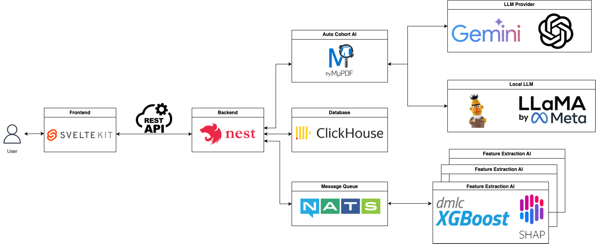

# 다학제간캡스톤디자인 16조 - 도시락

**산학 협력 기관**


**서울대학교병원 융합의학기술원 (SNUH Institute of Convergence Medicine)**

서울대학교병원 융합의학기술원은 2020년 3월 1일 설립되어, 인류의 질병과 장애, 의학적 난제를 해결하기 위한 혁신적인 의료기술을 개발하고 있습니다. 최첨단 연구시설과 융합의학 전문 인력, 그리고 독립적인 조직을 통해 융합의학 연구 역량을 집중시켜 성장을 거듭해 왔습니다.

---

## 연구자들의 편의를 위한 의료 CDM 데이터 Explorer - **Bento**

**Bento**는 일본어로 **도시락**이라는 의미를 가지고 있습니다.  
저희는 다양한 반찬을 원하는대로 골라 담는 이 도시락처럼, 연구진들이 방대한 의료데이터 속에서 필요한 정보를 쉽고 편리하게 선택하고 조합하여 분석할 수 있도록 돕겠다는 의미를 담아 이 프로젝트명을 **Bento**로 결정했습니다.

---


## 1. 프로젝트 소개

Bento는 급격히 증가하는 의료 데이터를 빠르고 효율적으로 탐색 및 시각화하여 연구 기획과 진행 속도를 획기적으로 개선하는 시스템입니다.

현재 가장 많이 사용하는 Atlas 프로그램보다 **최대 3000배 이상 빠른 속도**를 자랑하며, 기본 제공 차트 외에도 사용자가 직접 정의한 통계 지표를 기반으로 원하는 데이터를 자유롭게 그래프로 생성·분석할 수 있습니다.

Bento는 방대한 데이터 처리 병목 현상을 해소하고, AI 분석 도구를 활용해 연구 설계 단계의 신뢰도와 효율성을 높여 연구 진행 속도를 획기적으로 단축합니다.


---

## 2. 소개 영상
_(추가 예정)_

[소개 페이지 바로가기](https://kookmin-sw.github.io/capstone-2025-16/)
---

## 3. 팀 소개

|  |  |  |  |
| :---------------------------------------------: | :---------------------------------------: | :-----------------------------------------: | :-----------------------------------------: |
| [장원준](https://github.com/IamWonILuvWon)      | [임혜진](https://github.com/ima9ine4)      | [이재영](https://github.com/rktlskan021)    | [이수혁](https://github.com/cg10036)        |
| PM, AI Engineer                                | FrontEnd                                  | FrontEnd                                    | BackEnd                                    |
|     |  |     |                                             |
| [권세건](https://github.com/honeybugs)         | [정채원](https://github.com/chloebh9)      | [배진우](https://github.com/bgw4399)         |                                             |
| FrontEnd                                       | AI Engineer                               | AI Engineer                                 |                                             |


---

## 4. 주요 기능

| 기능 | 설명 |
| :---: | :---: |
| **코호트 정의** | 드래그 앤 드롭으로 필터 조건을 손쉽게 설정하고, 그 결과 선별된 환자 수를 실시간으로 확인할 수 있습니다.<br>직관적인 UI/UX와 LLM을 활용한 코호트 구성, 쿼리 load/export 기능을 제공합니다. |
| **통계** | 여러 코호트를 한눈에 비교·분석할 수 있는 그래프를 제공하며, <br>개별 환자의 상세 데이터도 실시간으로 확인할 수있습니다.|
| **환자군 특징 분석** | AI 분석을 통해 코호트 집단의 특징을 추가적으로 파악하여 연구진에게 제시합니다.<br>이를 통해 연구 계획에 빠진 내용이나 관련된 새로운 특징을 발견할 수 있습니다. |
| **자동 코호트 생성** | 텍스트 입력, 논문 드래그 앤 드롭 등을 통해 자동으로 코호트를 생성해 줍니다.<br>이를 통해 초보 연구자도 쉽게 사용할 수 있도록 환경을 제공하며, 연구자의 편리성을 높일 수 있습니다. |


## 5. 시스템 아키텍처

---

## 6. 기술 스택

| 포지션 | 스택 |
| :---: | :---: |
| **FrontEnd** |     |
| **BackEnd API** |    |
| **AI** |    |
| **Infra** |    |


## 7. 실행방법
### Common

```bash
git clone https://github.com/kookmin-sw/capstone-2025-16.git
cd capstone-2025-16
docker-compose up -d --build
```

###  [FrontEnd](https://github.com/kookmin-sw/capstone-2025-16/blob/master/frontend/README.md)

### [BackEnd](https://github.com/kookmin-sw/capstone-2025-16/blob/master/backend/README.md)

### [AI](https://github.com/kookmin-sw/capstone-2025-16/blob/master/ai/README.md)
